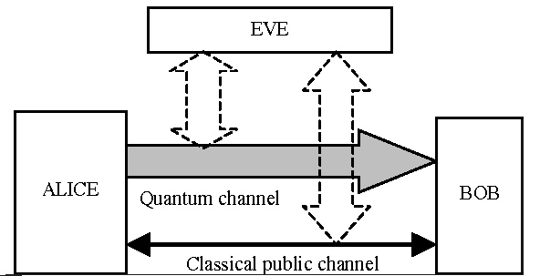
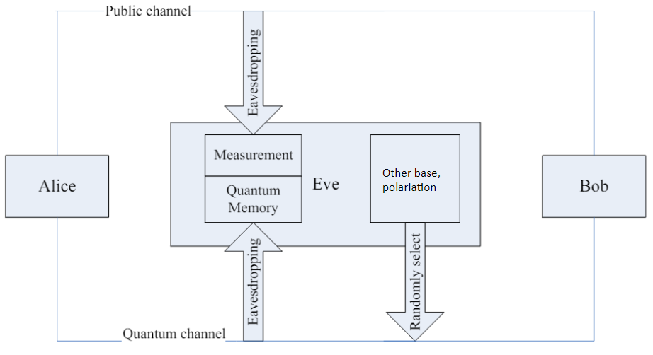

# BB84 Quantum Key Distribution

## Overview

BB84 is a quantum key distribution (QKD) protocol developed by Charles Bennett and Gilles Brassard in 1984. It enables two parties, Alice and Bob, to securely share a cryptographic key. The security of BB84 relies on the principles of quantum mechanics, specifically the behavior of photons and the no-cloning theorem.

### Key Principles

1. **Photon Polarization**: Alice encodes bits of information into photons using two sets of polarizations: Rectangular (Vertical/Horizontal) and Diagonal (Bottom-Left to Top-Right/Top-Left to Bottom-Right).
   
2. **Measurement**: Bob randomly chooses between Rectangular and Diagonal bases to measure the incoming photons. If Bob's measurement base matches Alice's encoding base, he retrieves the correct bit; otherwise, the result is random and discarded.

3. **Base Disclosure**: After measurement, Alice and Bob publicly share their measurement bases and keep only the bits where their bases matched. This forms the shared secret key.

## Man-in-the-Middle Attack

A Man-in-the-Middle (MitM) attack in BB84 involves an eavesdropper, Eve, who intercepts and potentially alters the photons sent between Alice and Bob. Eve's objectives and actions include:

1. **Interception**: Eve intercepts the photons sent from Alice to Bob. She then decides whether to measure the photons or forward them to Bob based on her own randomly chosen bases.

2. **Measurement**: If Eve measures a photon, she may alter its polarization based on her chosen basis. This introduces errors in Bob's measurements, potentially revealing her presence.

3. **Forwarding**: Eve forwards the photons to Bob after her measurement. If she did not measure a photon, it is forwarded unchanged.

### Impact

1. **Key Corruption**: Eve’s measurements and potential polarization flips introduce discrepancies between Alice's and Bob's key bits. This corruption affects the final key's integrity.

2. **Detection**: Alice and Bob can detect Eve’s presence by comparing a subset of their keys. An increased error rate in the key suggests eavesdropping.

### Results

- **Key Size and Accuracy**: With Eve’s intervention, the number of matching key bits between Alice and Bob decreases, and the key's accuracy is compromised.
- **Eve's Key**: Eve may obtain some bits of the key without being detected, but the accuracy of her key is lower compared to Bob's due to measurement errors.

## Man-in-the-Middle Attack Based on the Breidbart Basis

This attack allows an attacker (Eve) to achieve up to 85% bit matching without being detected by Alice and Bob, who use different polarization bases.

### Attack Scheme

The described Man-in-the-Middle attack proceeds as follows:

1. **Photon Preparation by Alice**: Alice polarizes the photons in BASE_P and BASE_X.
2. **Interception by Eve**: Eve intercepts the photons and stores them in quantum memory. She then re-sends them polarized with a new base (NEW_BASE).
3. **Measurement by Bob**: Bob measures the received photons with BASE_P and BASE_X.
4. **Base Exchange**: Alice and Bob exchange their base choices.
5. **Selection of Correct Measurements**: Eve keeps only the correct measurements corresponding to Alice's and Bob's bases.
6. **Key Testing**: Alice and Bob test a subset of bits to determine the error rate (QBER), which is around 15%.

### Mathematical Optimization

The attack optimizes the choice of bases used by Eve by introducing an intermediate basis between BASE_P and BASE_X. This intermediate basis is obtained by a π/8 rotation and allows Eve to achieve an average success rate of 85% on the bits, instead of 75% in the classical case.

### Measurements and Results

Eve’s measurement results show that she can obtain up to 85% correct results using the Breidbart basis while minimizing system disruption, thereby reducing the chances of detection by Alice and Bob.

| Incoming Qubit | Measurement 0b | Measurement 1b | Measurement 0+ | Measurement 1+ | Measurement 0x | Measurement 1x |
|----------------|----------------|----------------|----------------|----------------|----------------|----------------|
| 0              | 100%           | 0%             | 85%            | 15%            | 85%            | 15%            |
| 1              | 0%             | 100%           | 15%            | 85%            | 15%            | 85%            |

### Conclusion

The BB84 protocol, while secure under ideal conditions, is susceptible to various attacks including Man-in-the-Middle attacks. The Breidbart basis attack demonstrates that it is possible to achieve a high rate of bit matching and evade detection by optimizing the choice of measurement bases.

Others attacks exists based on reception timings but were not developped in this article.

## References

- [1] A new attack strategy for BB84 protocol based on Breidbart basis, Liu Dan; Pei Chang-xing; Quan Dong-xiao; Han Bao-bin; Zhao Nan
- [2] Cryptography from Noisy Storage, Stephanie Wehner; Christian Schaffner; Barbara M. Terhal
- [3] The intercept/resend attack and the delayed measurement attack on the QKD protocol based on the pre- and post-selection effect, Hiroo Azuma; Masashi Ban
- [4] 404 CTF: De l'écoute, pas très discrète, Sckathach