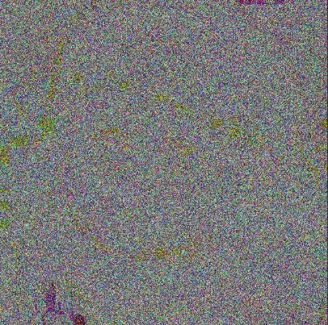
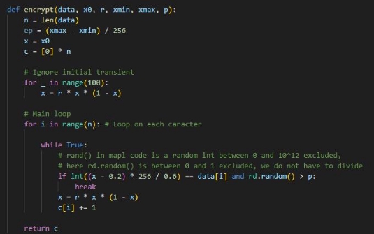
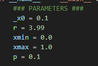
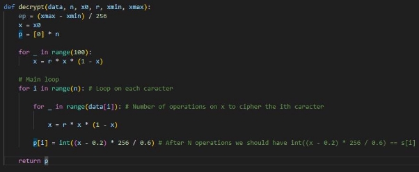
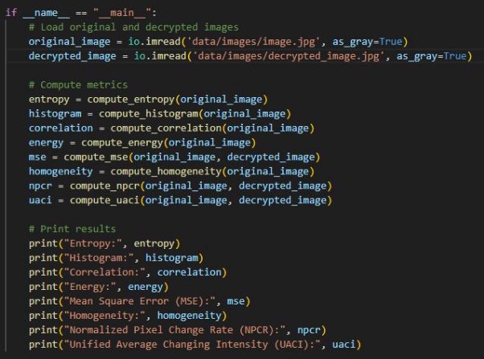

COLSON Hugo - Erasmus

# Baptista Cipher on text & images

This project implements Baptista's encryption algorithm based on the principles described in his paper on chaos and cryptography. In his paper, Baptista suggests that it is possible to encrypt a message (composed of characters from some alphabet) using the ergodic property of the simple low-dimensional and chaotic logistic equation.

## Encryption / Decryption Process

Chaotic Cryptography with the Logistic Equation (what we call Baptista Cipher later on): The fundamental idea is to encrypt each character of the message by representing it as the integer number of iterations performed in the logistic equation. This process facilitates the transfer of the trajectory of the logistic equation from an initial condition towards an ε-interval inside the logistic chaotic attractor.

*original image*

*ciphered image*

*deciphered image*

**Encryption**

The encryption with the Baptista Cipher, once understood, is pretty simple. We compute two operations which we will call

- **f: x->r\*x\*(1-x)**
- **g: x-> int((x-0.2) \* 256 / 0.6)**

Let’s consider x (x0 at the beginning). x will have the same role as an indicator. During our whole encryption we will compute **x = f(x)** a lot of times. And to be more precise we start with **x = f^100(x)** (compute 100x f to x). To randomize the entry.

Then we loop for each character the following sentence:

- while g(x) is not equal to the ith character, we compute f to x, and we cound 1

In the end, each character obtains a ciphered number which would be the number of f computations from x, to obtain g(x) equals the ith character of the plaintext.

Moreover, we add some randomness to this, and in fact, if “g(x) equals the ith character of the plaintext”, there is a p percent chance that we continue the loop.

Thus, more precisely, each character obtains a ciphered number which will be ONE POSSIBLE number of computations of f to x, to obtain g(x) equals the ith character.

What makes it very strong, is that the actual value of x at the ith character operation is different from x0. Which makes it much stronger than it would be, if the number of computations of f to x0 (!=x at this stage), to obtain g(x). (otherwise we could just do a corresponding table with the possible values).

**Decryption**

Once all the encryption is explained, it is easy to understand the decryption.

We just take x0, and compute f to x the number of times corresponding to the ith ciphertext number. (not to mention the initial 100 operations at the beginning).

In the end we obtain the initial plaintext/data. (we can use the image processing functions to obtain the initial image).

**Image Analysis**

For the previous image Ilaunched the following script, and got these results:

- **Entropy:** 12.630147340857178
- **Histogram:** [326041 ... 000000]

- **Correlation:** 1.0

- **Energy:** 80369.02574812503

- **Mean Square Error (MSE):** 1.8782016155167316e-05

- **Homogeneity:** 0.9746957308276583

- **Normalized Pixel Change Rate (NPCR):** 77.14581908410292

- **Unified Average Changing Intensity (UACI):** 0.0011367089309950278

## References

- *Chaos and Cryptography*, Vishaal Kapoor, 4th December 2003.

- *Improved affine encryption algorithm for color images using LFSR and XOR encryption*, Ayşegül Ihsan1 & Nurettin Doğan, April 2022