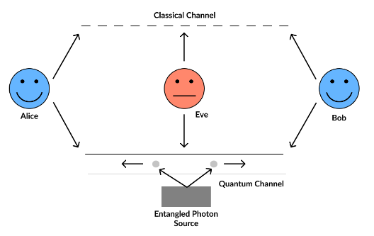
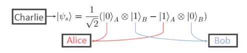
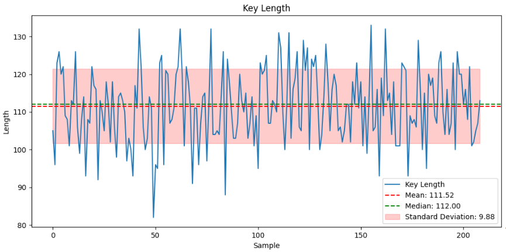
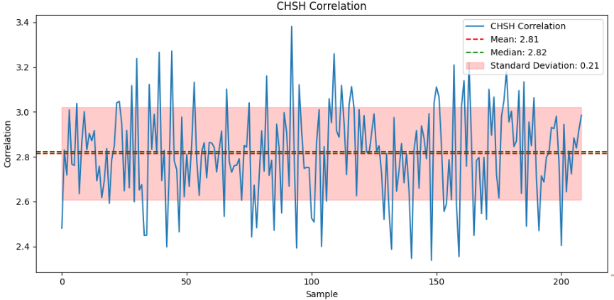
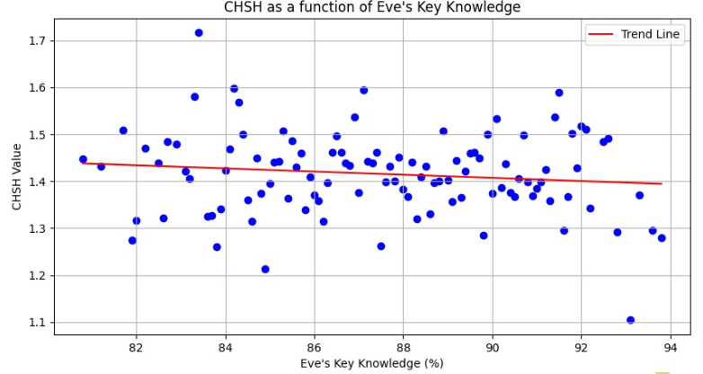

# E91 Protocol Implementation

This project implements the E91 quantum key distribution (QKD) protocol, which is based on the entanglement of photon pairs. The goal is to use this protocol to share a secret key between two parties while detecting any potential eavesdropper (Eve).

## Project Overview

1. [Protocol Overview](#protocol-overview)
2. [Physics Behind the Protocol](#physics-behind-the-protocol)
3. [Implementation](#implementation)
4. [Results](#results)
5. [Conclusion](#conclusion)
6. [References](#references)

---

## Protocol Overview

The E91 protocol follows these steps:

1. Produce N pairs of entangled photons.
2. Alice and Bob each choose a random measurement basis.
3. They measure their photons in their respective bases.
4. They keep only the measurements made with the same basis.
5. They compute the photon correlation (using CHSH statistics).
6. If no eavesdropper (Eve) is detected, they use the resulting key.

---

## Physics Behind the Protocol

The protocol is based on the following principles:

- **Entanglement**: Photon pairs are created in an entangled state (Bell State), meaning the measurement of one photon instantly affects the other, regardless of the distance.
- **Observer Effect**: Each measurement produces eigenvalues of ±1 (with +1 = 1 and -1 = 0), which are used to compute the correlation (CHSH statistic).
- **Eve's Impact**: If an eavesdropper (Eve) intercepts, the correlation between Alice and Bob’s measurements deviates from the expected values, signaling unauthorized presence.

---

## Implementation

The implementation was carried out in Python using the Qiskit library for quantum computing. It includes:

- Generation of entangled qubit pairs.
- Simulation of Alice and Bob’s measurements using random measurement bases.
- Calculation of CHSH statistics to evaluate potential eavesdropping.

---

## Results

### Key Length

The protocol was tested with **N = 500 qubit pairs**. The resulting key length after discarding bits where Alice and Bob’s measurement bases did not match is shown below.

### Correlation (CHSH)

The correlation between Alice and Bob, represented by the CHSH statistic, shows strong entanglement when no eavesdropper is present.

### Eve's Knowledge

The more information Eve attempts to gather about the key, the more the correlation between Alice and Bob deteriorates, rendering the key unusable.

---

## Conclusion

The E91 protocol has several advantages:

- It is theoretically unbreakable, even if the eavesdropper has infinite resources.
- The more Eve knows about the key, the less correlation there is between Alice and Bob.

However, it also presents some challenges:

- It is difficult to produce and maintain entanglement in a laboratory setting (recognized by the Nobel Prize in Physics 2022).
- The key generation rates are low due to the discarding of many measurements.

Overall, the E91 protocol is a complex but promising system for the future of quantum cryptography.

---

## References

[1] [E91 Protocol - Qiskit Tutorial](https://github.com/kardashin/E91_protocol/blob/master/E91_tutorial/E91_tutorial_github-friendly.ipynb)
[2] [Quantum Key Distribution (Wikipedia)](https://en.wikipedia.org/wiki/Quantum_key_distribution)
[3] [Lecture: Artur Ekert - IQIS Lecture 5.7](https://youtu.be/2ExG7UJgfmQ)
[4] [Ekert Protocol - Quantum Optics](https://youtu.be/zNIQ0FXq9tw)