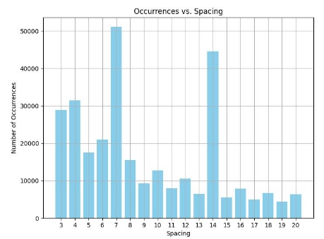
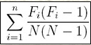
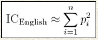
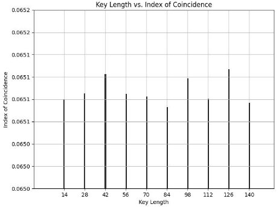
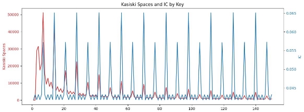
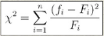
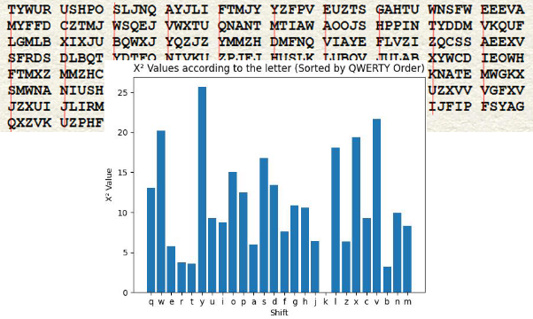

**Context:**

We have a lengthy message assumed to be in English and encrypted using the Vigenere cipher algorithm. The objective is to decrypt the message without knowing the key.

**Steps:**

1. **Determine the Key Length**
1. **Kasiski method**

*Kasiski result on spacing*

We can see that different values are highlighted: 14 and 7 here, which are multiples. This can be explained simply by the fact that patterns are repeated for multiples (a key of length 3 creates sequences of length 3 but also of length 6, one out of two, and so on).

The idea is to test these values as key values to be sure of the length of the key.

With this method we obtain good results, but we sometimes need a human check because the key is not the one with the biggest counter.

2. **Index of Coincidence Method**

For a given text, the coincidence coefficient is the sum of the occurrences of each character squared over the total number of characters squared.

But if the number of characters is n = 26, the formula is simplified and becomes the following:

We can see that this coefficient only depends on the sum of the given frequencies (squared), and not on which letters have that frequency.

We can then divide our text into sub-sections that are assumed to be shifted by the same distance, to create a sample of our text that has undergone the same shift.

Using all these samples, we can calculate the average CI of the samples and obtain the similarity of our text to the English language.

The closer the text is to the English language, the closer it will be to ICen=0.686, and the more random it is, the closer it will be to ICrand=0.038.

*Best ICs results among 150 keys*

For more details, see [Source](images/https://pages.mtu.edu/~shene/NSF-4/Tutorial/VIG/Vig-IOC-Len.html)

With this method **guarantee us to guess the key or a multiple** of the key (ex: 2\*key).

3. **Combination of Kasiski and IC**

We can see the result of a shared work between Kasiski and IC approach on the same ciphered text:

*Shared results of both IC & Kasiski algorithms*

2. **Determine the Key knowing the key length**

Using brute-force would lead to a 26^k possibilities which would be too long to verify, this is why we need a **frequency analysis**.

1. **Using monograms (not asked, you can skip)**

I first used a monogram approach which is basically the same as the ChiSquare method but, only based on the fact that “E” is the most common letter in English, which worked for little keys, but ended up having some error on larger keys.

2. **ChiSquare method**

The ChiSquare method is based on calculating the distance between the frequency of all letters in a given text, with the frequency of each of these letters in the English language.

For a given key length, each segment of text, with a length equal to the key, undergoes the same shift as another segment. Additionally, every character at a particular position within a segment experiences an identical shift as all other characters at the same position in other segments. We can then carry out a frequency analysis by concatenating all the characters that have been shifted in the same way, and by using ChiSquare, we can find out with which shift these new blocks are closest to English, and get therefore, a character of the key.

Exemple: for a key of length 5, guessing the first character, all the letters in red have undergone the same shift.

*ChiSquare calculation for all shifts of a section of the text*

**Summary:**

To decrypt the Vigenere cypher we need to work on two steps: determine the length of the key then determine the key. To determine the length of the key I implemented two of the possible methods Kasiski and Index of Coincidence. IC definitely had better results because Kasiski needed a human check on some of the keys.

To determine the key then, a simple Monogram approach wasn’t enough, therefore I implemented a ChiSquare calculation based on the distance between the frequency of the letters in our text and in the English language.

For the key guessing, in all my tests, I have a 100% guess if we consider that a multiple of the key length is a great answer.

For guessing the key, the algorithm never failed. I made tests from key length 1 to 150.
